# [📈 Live Status](https://status.architech.network): <!--live status--> **🟧 Partial outage**

This repository contains the open-source uptime monitor and status page for [BarkleyREI](http://www.barkleyrei.com/), powered by [Upptime](https://github.com/upptime/upptime).

With [Upptime](https://upptime.js.org), you can get your own unlimited and free uptime monitor and status page, powered entirely by a GitHub repository. We use [Issues](https://github.com/BarkleyREI/ArchiTECH-upptime/issues) as incident reports, [Actions](https://github.com/BarkleyREI/ArchiTECH-upptime/actions) as uptime monitors, and [Pages](https://status.architech.network) for the status page.

<!--start: status pages-->
<!-- This summary is generated by Upptime (https://github.com/upptime/upptime) -->
<!-- Do not edit this manually, your changes will be overwritten -->
<!-- prettier-ignore -->
| URL | Status | History | Response Time | Uptime |
| --- | ------ | ------- | ------------- | ------ |
|  [ArchiTECH Service](https://www.builtforyou.com/ping.html) | 🟩 Up | [archi-tech-service.yml](https://github.com/BarkleyREI/ArchiTECH-upptime/commits/master/history/archi-tech-service.yml) | 

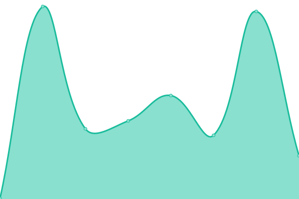 383ms
     
 | 

<a href="https://status.architech.network/history/archi-tech-service">100.00%</a>
    

|  [ArchiTECH Tourism](https://architech.travel/ping.html) | 🟩 Up | [archi-tech-tourism.yml](https://github.com/BarkleyREI/ArchiTECH-upptime/commits/master/history/archi-tech-tourism.yml) | 

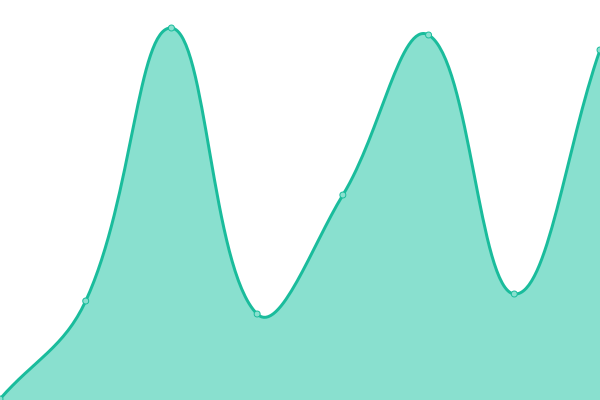 5742ms
     
 | 

<a href="https://status.architech.network/history/archi-tech-tourism">100.00%</a>
    

|  [ArchiTECH Help](https://www.architech.help/ping.html) | 🟩 Up | [archi-tech-help.yml](https://github.com/BarkleyREI/ArchiTECH-upptime/commits/master/history/archi-tech-help.yml) | 

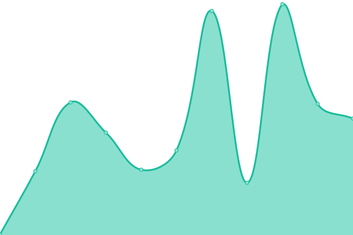 383ms
     
 | 

<a href="https://status.architech.network/history/archi-tech-help">100.00%</a>
    

|  [ArchiTECH Help - search](https://www.architech.help/results?search=) | 🟩 Up | [archi-tech-help-search.yml](https://github.com/BarkleyREI/ArchiTECH-upptime/commits/master/history/archi-tech-help-search.yml) | 

 388ms
     
 | 

<a href="https://status.architech.network/history/archi-tech-help-search">100.00%</a>
    

|  [Allegany County, The Mountain Side of Maryland](https://www.mdmountainside.com/ping.html) | 🟩 Up | [allegany-county-the-mountain-side-of-maryland.yml](https://github.com/BarkleyREI/ArchiTECH-upptime/commits/master/history/allegany-county-the-mountain-side-of-maryland.yml) | 

 351ms
     
 | 

<a href="https://status.architech.network/history/allegany-county-the-mountain-side-of-maryland">100.00%</a>
    

|  [Allegany County, The Mountain Side of Maryland - Search](https://www.mdmountainside.com/results?search=) | 🟩 Up | [allegany-county-the-mountain-side-of-maryland-search.yml](https://github.com/BarkleyREI/ArchiTECH-upptime/commits/master/history/allegany-county-the-mountain-side-of-maryland-search.yml) | 

 958ms
     
 | 

<a href="https://status.architech.network/history/allegany-county-the-mountain-side-of-maryland-search">100.00%</a>
    

|  [PA Route 6 Alliance](https://www.paroute6.com/ping.html) | 🟩 Up | [pa-route-6-alliance.yml](https://github.com/BarkleyREI/ArchiTECH-upptime/commits/master/history/pa-route-6-alliance.yml) | 

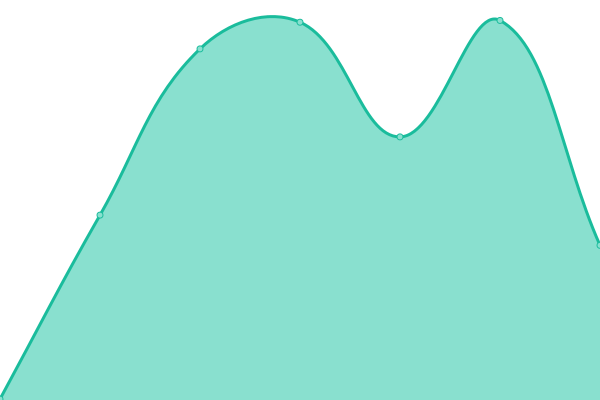 352ms
     
 | 

<a href="https://status.architech.network/history/pa-route-6-alliance">100.00%</a>
    

|  [PA Route 6 Alliance - Search](https://www.paroute6.com/results?search=) | 🟩 Up | [pa-route-6-alliance-search.yml](https://github.com/BarkleyREI/ArchiTECH-upptime/commits/master/history/pa-route-6-alliance-search.yml) | 

 910ms
     
 | 

<a href="https://status.architech.network/history/pa-route-6-alliance-search">100.00%</a>
    

|  [Raystown Lake](https://www.raystown.org/ping.html) | 🟩 Up | [raystown-lake.yml](https://github.com/BarkleyREI/ArchiTECH-upptime/commits/master/history/raystown-lake.yml) | 

 354ms
     
 | 

<a href="https://status.architech.network/history/raystown-lake">100.00%</a>
    

|  [Raystown Lake - Search](https://www.raystown.org/results?search=) | 🟩 Up | [raystown-lake-search.yml](https://github.com/BarkleyREI/ArchiTECH-upptime/commits/master/history/raystown-lake-search.yml) | 

 874ms
     
 | 

<a href="https://status.architech.network/history/raystown-lake-search">100.00%</a>
    

|  [Visit Santa Rosa](https://www.visitsantarosa.com/ping.html) | 🟩 Up | [visit-santa-rosa.yml](https://github.com/BarkleyREI/ArchiTECH-upptime/commits/master/history/visit-santa-rosa.yml) | 

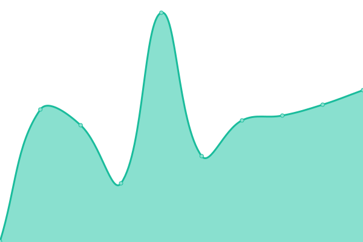 336ms
     
 | 

<a href="https://status.architech.network/history/visit-santa-rosa">100.00%</a>
    

|  [Visit Santa Rosa - Search](https://www.visitsantarosa.com/results?search=) | 🟩 Up | [visit-santa-rosa-search.yml](https://github.com/BarkleyREI/ArchiTECH-upptime/commits/master/history/visit-santa-rosa-search.yml) | 

 868ms
     
 | 

<a href="https://status.architech.network/history/visit-santa-rosa-search">100.00%</a>
    

|  [Visit the Delta](https://www.visitthedelta.com/ping.html) | 🟩 Up | [visit-the-delta.yml](https://github.com/BarkleyREI/ArchiTECH-upptime/commits/master/history/visit-the-delta.yml) | 

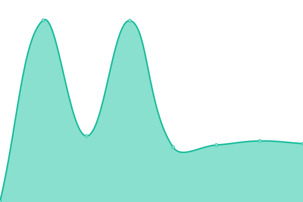 363ms
     
 | 

<a href="https://status.architech.network/history/visit-the-delta">100.00%</a>
    

|  [Visit the Delta - Search](https://www.visitthedelta.com/results?search=) | 🟩 Up | [visit-the-delta-search.yml](https://github.com/BarkleyREI/ArchiTECH-upptime/commits/master/history/visit-the-delta-search.yml) | 

 829ms
     
 | 

<a href="https://status.architech.network/history/visit-the-delta-search">100.00%</a>
    

|  [Visit Vicksburg](https://www.visitvicksburg.com/ping.html) | 🟩 Up | [visit-vicksburg.yml](https://github.com/BarkleyREI/ArchiTECH-upptime/commits/master/history/visit-vicksburg.yml) | 

 372ms
     
 | 

<a href="https://status.architech.network/history/visit-vicksburg">100.00%</a>
    

|  [Visit Vicksburg - search](https://www.visitvicksburg.com/results?search=) | 🟩 Up | [visit-vicksburg-search.yml](https://github.com/BarkleyREI/ArchiTECH-upptime/commits/master/history/visit-vicksburg-search.yml) | 

 794ms
     
 | 

<a href="https://status.architech.network/history/visit-vicksburg-search">100.00%</a>
    

|  [University of Virginia School of Architecture](https://www.arch.virginia.edu/ping.html) | 🟩 Up | [university-of-virginia-school-of-architecture.yml](https://github.com/BarkleyREI/ArchiTECH-upptime/commits/master/history/university-of-virginia-school-of-architecture.yml) | 

 559ms
     
 | 

<a href="https://status.architech.network/history/university-of-virginia-school-of-architecture">100.00%</a>
    

|  [University of Virginia School of Architecture - search](https://www.arch.virginia.edu/results?search=) | 🟩 Up | [university-of-virginia-school-of-architecture-search.yml](https://github.com/BarkleyREI/ArchiTECH-upptime/commits/master/history/university-of-virginia-school-of-architecture-search.yml) | 

 568ms
     
 | 

<a href="https://status.architech.network/history/university-of-virginia-school-of-architecture-search">100.00%</a>
    

|  [LuCa National Training Network](https://www.lucatraining.org/ping.html) | 🟩 Up | [lu-ca-national-training-network.yml](https://github.com/BarkleyREI/ArchiTECH-upptime/commits/master/history/lu-ca-national-training-network.yml) | 

 568ms
     
 | 

<a href="https://status.architech.network/history/lu-ca-national-training-network">100.00%</a>
    

|  [LuCa National Training Network - search](https://www.lucatraining.org/results?search=) | 🟩 Up | [lu-ca-national-training-network-search.yml](https://github.com/BarkleyREI/ArchiTECH-upptime/commits/master/history/lu-ca-national-training-network-search.yml) | 

 553ms
     
 | 

<a href="https://status.architech.network/history/lu-ca-national-training-network-search">100.00%</a>
    

|  [Redwood](https://demo-redwood-v1.builtforyou.com/ping.html) | 🟩 Up | [redwood.yml](https://github.com/BarkleyREI/ArchiTECH-upptime/commits/master/history/redwood.yml) | 

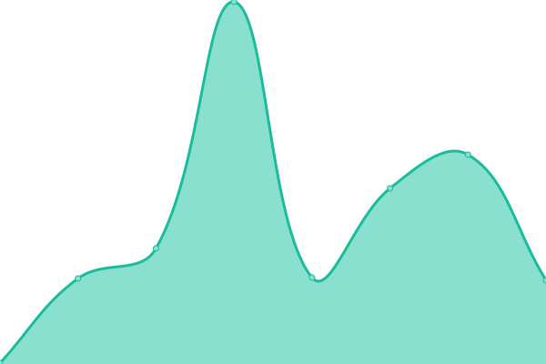 348ms
     
 | 

<a href="https://status.architech.network/history/redwood">100.00%</a>
    

|  [Redwood - Search](https://demo-redwood-v1.builtforyou.com/results?search=) | 🟥 Down | [redwood-search.yml](https://github.com/BarkleyREI/ArchiTECH-upptime/commits/master/history/redwood-search.yml) | 

 342ms
     
 | 

<a href="https://status.architech.network/history/redwood-search">100.00%</a>
    

|  [Pine Ridge](https://demo-pineridge-v1.builtforyou.com/ping.html) | 🟩 Up | [pine-ridge.yml](https://github.com/BarkleyREI/ArchiTECH-upptime/commits/master/history/pine-ridge.yml) | 

 370ms
     
 | 

<a href="https://status.architech.network/history/pine-ridge">100.00%</a>
    

|  [Pine Ridge - Search](https://demo-pineridge-v1.builtforyou.com/results?search=) | 🟩 Up | [pine-ridge-search.yml](https://github.com/BarkleyREI/ArchiTECH-upptime/commits/master/history/pine-ridge-search.yml) | 

 781ms
     
 | 

<a href="https://status.architech.network/history/pine-ridge-search">100.00%</a>
    

|  [Everest](https://everest.builtforyou.com/ping.html) | 🟩 Up | [everest.yml](https://github.com/BarkleyREI/ArchiTECH-upptime/commits/master/history/everest.yml) | 

 354ms
     
 | 

<a href="https://status.architech.network/history/everest">100.00%</a>
    

|  [Everest - Search](https://everest.builtforyou.com/results?search=) | 🟩 Up | [everest-search.yml](https://github.com/BarkleyREI/ArchiTECH-upptime/commits/master/history/everest-search.yml) | 

 816ms
     
 | 

<a href="https://status.architech.network/history/everest-search">100.00%</a>
    

|  [Outdoors](https://demo-outdoors-v1.builtforyou.com/ping.html) | 🟩 Up | [outdoors.yml](https://github.com/BarkleyREI/ArchiTECH-upptime/commits/master/history/outdoors.yml) | 

 368ms
     
 | 

<a href="https://status.architech.network/history/outdoors">100.00%</a>
    

|  [Outdoors - Search](https://demo-outdoors-v1.builtforyou.com/results?search=) | 🟩 Up | [outdoors-search.yml](https://github.com/BarkleyREI/ArchiTECH-upptime/commits/master/history/outdoors-search.yml) | 

 433ms
     
 | 

<a href="https://status.architech.network/history/outdoors-search">100.00%</a>
    

|  [Coastal](https://demo-coastal-v1.builtforyou.com/ping.html) | 🟩 Up | [coastal.yml](https://github.com/BarkleyREI/ArchiTECH-upptime/commits/master/history/coastal.yml) | 

 356ms
     
 | 

<a href="https://status.architech.network/history/coastal">100.00%</a>
    

|  [Coastal - Search](https://demo-coastal-v1.builtforyou.com/results?search=) | 🟩 Up | [coastal-search.yml](https://github.com/BarkleyREI/ArchiTECH-upptime/commits/master/history/coastal-search.yml) | 

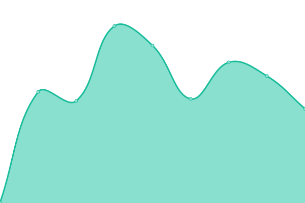 426ms
     
 | 

<a href="https://status.architech.network/history/coastal-search">100.00%</a>
    

|  [Winter](https://demo-winter-v1.builtforyou.com/ping.html) | 🟩 Up | [winter.yml](https://github.com/BarkleyREI/ArchiTECH-upptime/commits/master/history/winter.yml) | 

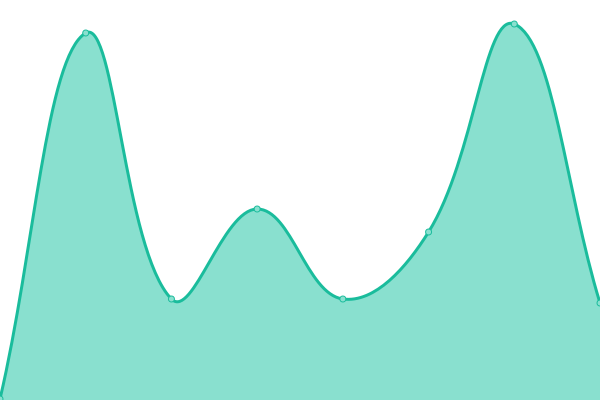 347ms
     
 | 

<a href="https://status.architech.network/history/winter">100.00%</a>
    

|  [Winter - Search](https://demo-winter-v1.builtforyou.com/results?search=) | 🟩 Up | [winter-search.yml](https://github.com/BarkleyREI/ArchiTECH-upptime/commits/master/history/winter-search.yml) | 

 407ms
     
 | 

<a href="https://status.architech.network/history/winter-search">100.00%</a>
    

|  [Bear's Woods](https://demo-bearswoods-v1.builtforyou.com/ping.html) | 🟩 Up | [bear-s-woods.yml](https://github.com/BarkleyREI/ArchiTECH-upptime/commits/master/history/bear-s-woods.yml) | 

 362ms
     
 | 

<a href="https://status.architech.network/history/bear-s-woods">100.00%</a>
    

|  [Bear's Woods - Search](https://demo-bearswoods-v1.builtforyou.com/results?search=) | 🟥 Down | [bear-s-woods-search.yml](https://github.com/BarkleyREI/ArchiTECH-upptime/commits/master/history/bear-s-woods-search.yml) | 

 377ms
     
 | 

<a href="https://status.architech.network/history/bear-s-woods-search">100.00%</a>
    

|  [Norcal](https://demo-norcal-v1.builtforyou.com/ping.html) | 🟩 Up | [norcal.yml](https://github.com/BarkleyREI/ArchiTECH-upptime/commits/master/history/norcal.yml) | 

 346ms
     
 | 

<a href="https://status.architech.network/history/norcal">100.00%</a>
    

|  [Norcal - Search](https://demo-norcal-v1.builtforyou.com/results?search=) | 🟥 Down | [norcal-search.yml](https://github.com/BarkleyREI/ArchiTECH-upptime/commits/master/history/norcal-search.yml) | 

 322ms
     
 | 

<a href="https://status.architech.network/history/norcal-search">100.00%</a>
    

|  [Adventure](https://demo-adventure-v1.builtforyou.com/ping.html) | 🟩 Up | [adventure.yml](https://github.com/BarkleyREI/ArchiTECH-upptime/commits/master/history/adventure.yml) | 

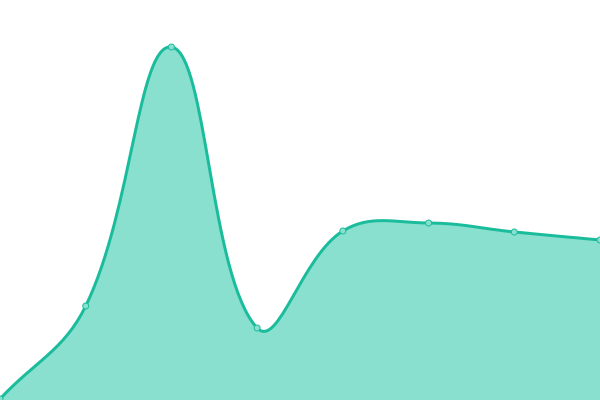 336ms
     
 | 

<a href="https://status.architech.network/history/adventure">100.00%</a>
    

|  [Adventure - Search](https://demo-adventure-v1.builtforyou.com/results?search=) | 🟩 Up | [adventure-search.yml](https://github.com/BarkleyREI/ArchiTECH-upptime/commits/master/history/adventure-search.yml) | 

 789ms
     
 | 

<a href="https://status.architech.network/history/adventure-search">100.00%</a>
    

|  [Lybart College](https://demo-lybart-v1.builtforyou.com/ping.html) | 🟩 Up | [lybart-college.yml](https://github.com/BarkleyREI/ArchiTECH-upptime/commits/master/history/lybart-college.yml) | 

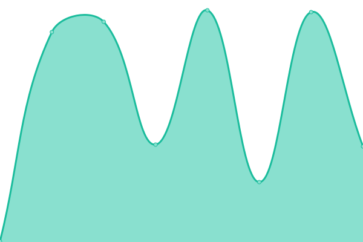 360ms
     
 | 

<a href="https://status.architech.network/history/lybart-college">100.00%</a>
    

|  [Lybart College - Search](https://demo-lybart-v1.builtforyou.com/results?search=) | 🟩 Up | [lybart-college-search.yml](https://github.com/BarkleyREI/ArchiTECH-upptime/commits/master/history/lybart-college-search.yml) | 

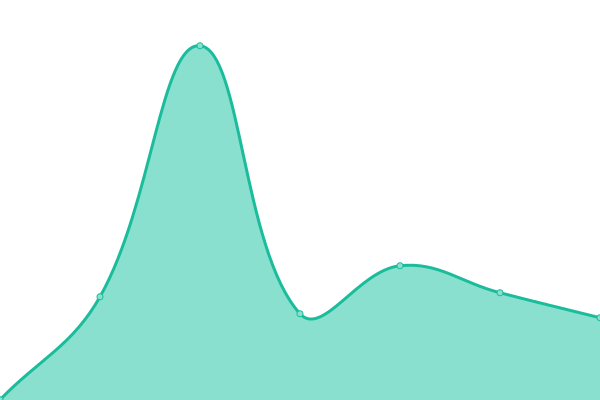 506ms
     
 | 

<a href="https://status.architech.network/history/lybart-college-search">100.00%</a>
    

|  [Lybart College (v2)](https://demo-lybart-v2.builtforyou.com/ping.html) | 🟩 Up | [lybart-college-v2.yml](https://github.com/BarkleyREI/ArchiTECH-upptime/commits/master/history/lybart-college-v2.yml) | 

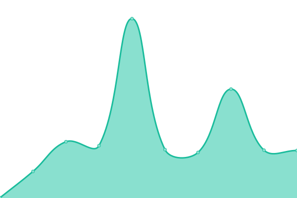 352ms
     
 | 

<a href="https://status.architech.network/history/lybart-college-v2">100.00%</a>
    

|  [Lybart College (v2) - Search](https://demo-lybart-v2.builtforyou.com/results?search=) | 🟩 Up | [lybart-college-v2-search.yml](https://github.com/BarkleyREI/ArchiTECH-upptime/commits/master/history/lybart-college-v2-search.yml) | 

 442ms
     
 | 

<a href="https://status.architech.network/history/lybart-college-v2-search">100.00%</a>
    

<!--end: status pages-->

[**Visit our status website →**](https://status.architech.network)

## 📄 License

- Code: [MIT](./LICENSE) © [BarkleyREI](http://www.barkleyrei.com/)
- Data in the `./history` directory: [Open Database License](https://opendatacommons.org/licenses/odbl/1-0/)
