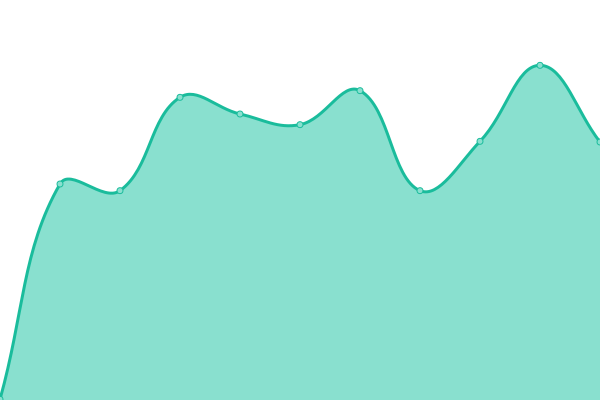
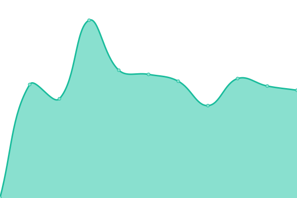

# [📈 Live Status](https://status.architech.network): <!--live status--> **🟩 All systems operational**

This repository contains the open-source uptime monitor and status page for [BarkleyREI](http://www.barkleyrei.com/), powered by [Upptime](https://github.com/upptime/upptime).

With [Upptime](https://upptime.js.org), you can get your own unlimited and free uptime monitor and status page, powered entirely by a GitHub repository. We use [Issues](https://github.com/BarkleyREI/ArchiTECH-upptime/issues) as incident reports, [Actions](https://github.com/BarkleyREI/ArchiTECH-upptime/actions) as uptime monitors, and [Pages](https://status.architech.network) for the status page.

<!--start: status pages-->
<!-- This summary is generated by Upptime (https://github.com/upptime/upptime) -->
<!-- Do not edit this manually, your changes will be overwritten -->

| URL                                                                                        | Status | History                                                                                                                                                                       | Response Time                                                                                                      | Uptime                                                                                                                                                                                                                                                                                                 |
| ------------------------------------------------------------------------------------------ | ------ | ----------------------------------------------------------------------------------------------------------------------------------------------------------------------------- | ------------------------------------------------------------------------------------------------------------------ | ------------------------------------------------------------------------------------------------------------------------------------------------------------------------------------------------------------------------------------------------------------------------------------------------------ |
| [ArchiTECH Service](https://www.builtforyou.com/ping.html)                                 | 🟩 Up  | [archi-tech-service.yml](https://github.com/BarkleyREI/ArchiTECH-upptime/commits/master/history/archi-tech-service.yml)                                                       |  373ms                            |                                                        |
| [Architech Help](https://www.architech.help/ping.html)                                     | 🟩 Up  | [architech-help.yml](https://github.com/BarkleyREI/ArchiTECH-upptime/commits/master/history/architech-help.yml)                                                               |  436ms                                |                                                                |
| [Allegany County, The Mountain Side of Maryland](https://www.mdmountainside.com/ping.html) | 🟩 Up  | [allegany-county-the-mountain-side-of-maryland.yml](https://github.com/BarkleyREI/ArchiTECH-upptime/commits/master/history/allegany-county-the-mountain-side-of-maryland.yml) |  392ms |  |
| [PA Route 6 Alliance](https://www.paroute6.com/ping.html)                                  | 🟩 Up  | [pa-route-6-alliance.yml](https://github.com/BarkleyREI/ArchiTECH-upptime/commits/master/history/pa-route-6-alliance.yml)                                                     |  365ms                           |                                                      |
| [Raystown Lake](https://www.raystown.org/ping.html)                                        | 🟩 Up  | [raystown-lake.yml](https://github.com/BarkleyREI/ArchiTECH-upptime/commits/master/history/raystown-lake.yml)                                                                 |  375ms                                 |                                                                  |
| [Visit Santa Rosa](https://www.visitsantarosa.com/ping.html)                               | 🟩 Up  | [visit-santa-rosa.yml](https://github.com/BarkleyREI/ArchiTECH-upptime/commits/master/history/visit-santa-rosa.yml)                                                           |  374ms                              |                                                            |
| [Visit the Delta](https://www.visitthedelta.com/ping.html)                                 | 🟩 Up  | [visit-the-delta.yml](https://github.com/BarkleyREI/ArchiTECH-upptime/commits/master/history/visit-the-delta.yml)                                                             |  397ms                               |                                                              |
| [Visit Vicksburg](https://www.visitvicksburg.com/ping.html)                                | 🟩 Up  | [visit-vicksburg.yml](https://github.com/BarkleyREI/ArchiTECH-upptime/commits/master/history/visit-vicksburg.yml)                                                             |  372ms                               |                                                              |
| [University of Virginia School of Architecture](https://www.arch.virginia.edu/ping.html)   | 🟩 Up  | [university-of-virginia-school-of-architecture.yml](https://github.com/BarkleyREI/ArchiTECH-upptime/commits/master/history/university-of-virginia-school-of-architecture.yml) |  551ms |  |
| [LuCa National Training Network](https://www.lucatraining.org/ping.html)                   | 🟩 Up  | [lu-ca-national-training-network.yml](https://github.com/BarkleyREI/ArchiTECH-upptime/commits/master/history/lu-ca-national-training-network.yml)                             |  613ms               |                              |

<!--end: status pages-->

[**Visit our status website →**](https://status.architech.network)

## 📄 License

- Code: [MIT](./LICENSE) © [BarkleyREI](http://www.barkleyrei.com/)
- Data in the `./history` directory: [Open Database License](https://opendatacommons.org/licenses/odbl/1-0/)
